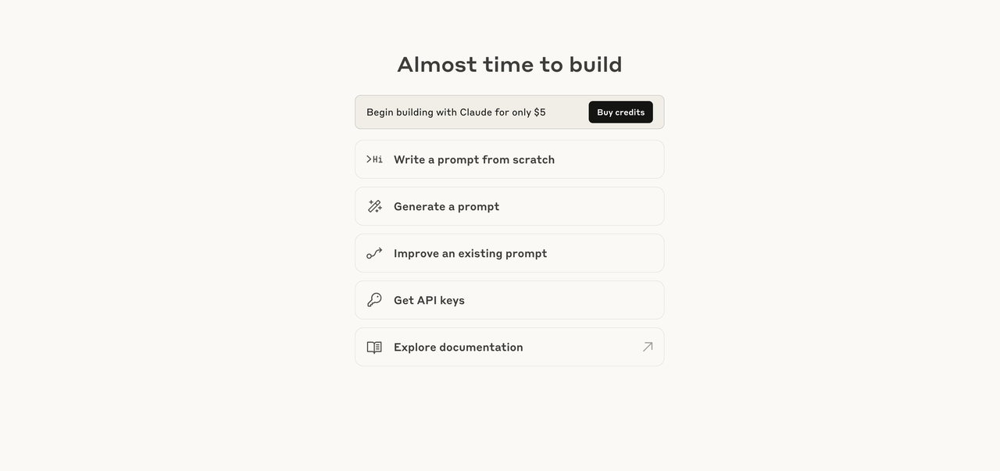
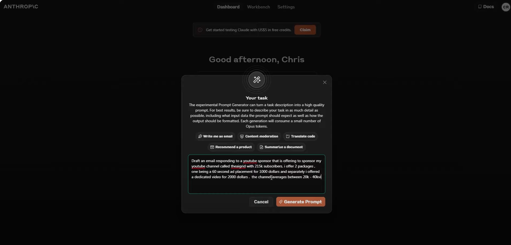
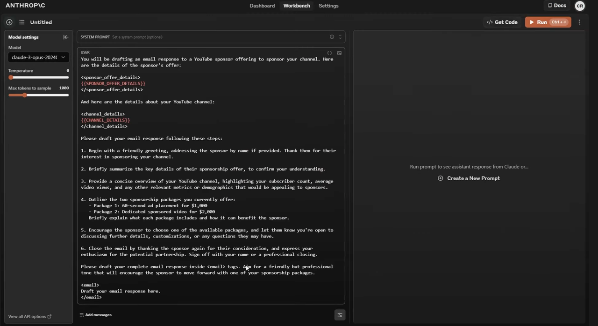
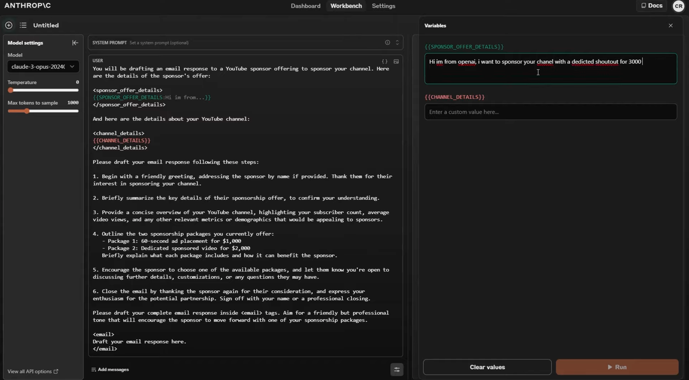
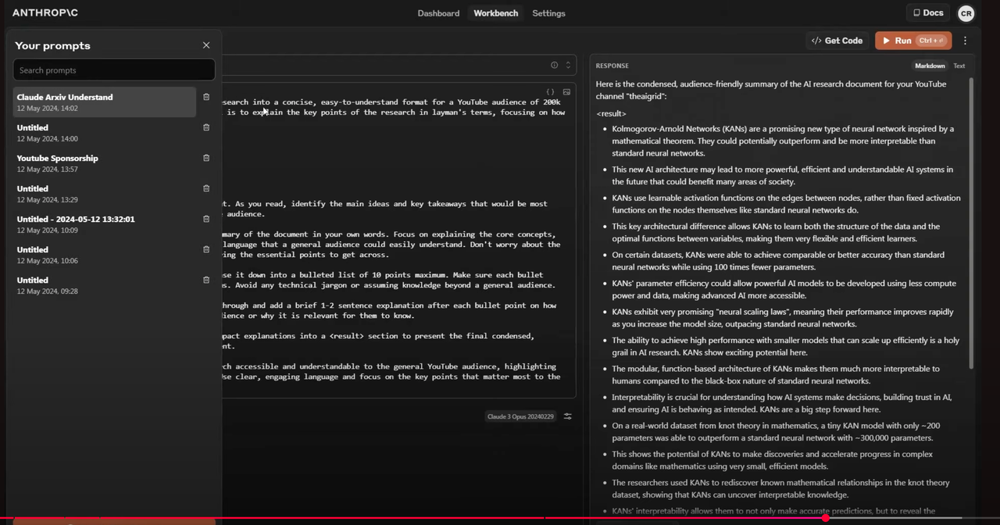

# 产品需求设计

# 背景
## prompt优化器
### 功能需求
#### Goals
- 主体功能：用户输入少量的文字，生成一个prompt（基于模板生成、大模型分析生成）
- playground：生成的prompt，可以运行测试，点击运行时，输入变量，调用大模型得到结果
- 历史prompt列表展示，随时可以点进去点击运行
- 前端页面配置化：选择model、支持配置temperature、配置最大输出token数量、配置api-key

#### NoGoals
- 暂时不做用户体系
- 暂时不做版本控制
- 暂时不做模板更改
- 暂时不做prompt相似搜索
- 暂时不做用户

### 非功能需求
- 易于集成、二改
- 文档完善，结构合理
- docker部署

### 需要借鉴的产品
Anthropic

## 技术调研

## 原型图

## 技术选型
后端：python+flask
模板引擎：jinja2
前端：react
持久层：mysql

## 存储层设计
内置三种模板
- prompt_template表（id、 name、content、status）
- prompt表（id、name、latest_version、created_time、updated_time、status、source）
- prompt_version表 (id、prompt_id、version、content、creator、created_time、updated_time、status)
- prompt_shots表 (id、prompt_id、content)

